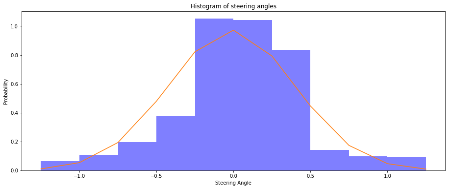

# **Behavioral Cloning** 
---

To see the final model's performance, click on the following [link]().  

---
### Files Submitted & Code Quality

#### 1. Submission includes all required files and can be used to run the simulator in autonomous mode

My project includes the following files:
* model.pynb containing the script to create and train the model
* drive.py for driving the car in autonomous mode
* model.h5 containing a trained convolution neural network 
* writeup_report.md or writeup_report.pdf summarizing the results

#### 2. Submission includes functional code

Using the Udacity provided simulator and my drive.py file, the car can be driven autonomously around the track by executing 

```sh
python drive.py model.h5
```

#### 3. Submission code is usable and readable

The model.ipynb file contains the code for training and saving the convolution neural network. The file shows the pipeline I used for training and validating the model, and it contains comments to explain how the code works.

### Model Architecture and Training Strategy

#### 1. An appropriate model architecture has been employed

My model consists of a convolution neural network with 5x5 or 3x3 filter sizes and depths between 34 and 64 (model.ipynb cell 27) 

The model includes RELU layers to introduce nonlinearity, and the data is normalized in the model using a Keras lambda layer (model.ipynb cell 27, line 10). 

#### 2. Attempts to reduce overfitting in the model

Instead of using regularization techniques like Dropout or Max Pooling to avoid overfitting, the model was trained for only 5 epochs. Furthermore, the model was trained and validated on different data sets. Lastly, the model was tested by running it through the simulator and ensuring that the vehicle could stay on the track.

#### 3. Model parameter tuning

The model used an adam optimizer, so the learning rate was not tuned manually (model.ipynb cell 27, line 28).

#### 4. Appropriate training data

Training data was chosen to keep the vehicle driving on the road. I used a combination of center lane driving, recovering from the left and right sides of the road.  

For details about how I created the training data, see the next section. 

### Model Architecture and Training Strategy

#### 1. Solution Design Approach

Self driving cars are a fairly well researched problem. I started off by replicating the model architecture for a successful model produced by NVIDIA Autonomous Car Group. This did relatively well on a simulated track but failed to complete a lap. 

I then collected my own data to see if that would make a difference. I also started using the data provided by the left and right cameras with an appropriate correction factor on the steering angle. The idea here was that this would help the car remain in the middle of the lane. 

Although all of this helped, the critical point was when I looked at the distribution of the steering angles in my data.  



As you can see, its heavily biased towards low steering angles which corresponds to driving in a near-straight line. Naturally this bias affected my model's ability to drive a car around turns. To combat this, I sampled data (with replacement) equally from each of the bins shown in the histogram above. While this may seem drastic, this did the trick and my model was able to successfully complete a lap around simulated track after implementing this change.    

#### 2. Final Model Architecture

The final model architecture (model.py lines 18-24) consisted of a convolution neural network with the following layers and layer sizes ...

Here is a visualization of the architecture (note: visualizing the architecture is optional according to the project rubric)


For more information, see the following [link](https://devblogs.nvidia.com/parallelforall/deep-learning-self-driving-cars/). 

#### 3. Creation of the Training Set & Training Process

To capture good driving behavior, I first recorded two laps on track one using center lane driving. Here is an example image of center lane driving:

![alt text][image2]

I then recorded the vehicle recovering from the left side and right sides of the road back to center so that the vehicle would learn to .... These images show what a recovery looks like starting from ... :

![alt text][image3]
![alt text][image4]
![alt text][image5]

Then I repeated this process on track two in order to get more data points.

After the collection process, I had 51,585 number of data points. I then preprocessed this data by ...

I finally randomly shuffled the data set and put 20% of the data into a validation set. 

I used this training data for training the model. The validation set helped determine if the model was over or under fitting. The ideal number of epochs was 5 as the MSE loss did not change much after that. I used an adam optimizer so that manually training the learning rate wasn't necessary.
